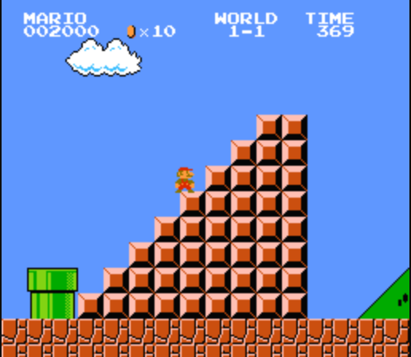

# Mario Staircase

Each level of Mario ends with a staircase.

Example:



This staircase can be of variable height.

Write a program that asks the user for a size and displays a staircase of the desired size in the terminal using the `#` character.
If a negative or zero height is provided, your program should display "IMPOSSIBLE".

Examples:
* staircase of size 3
```
  ##
   ###
  ####
```
* staircase of size 5
```
    ##
   ###
  ####
   #####
  ######
```
* staircase of size -3
```
IMPOSSIBLE
```

---

# Escalier Mario

Chaque niveau de maro se termine par un escalier.

Exemple:


Cette escalier peut être de hauteur variable.

Ecrire un programme qui demande une taille à l'utilisateur et affiche un escalier de la taille voulue dans le terminal en utilisant le caractère `#`
Si un hauteur négative ou nulle est renseignée, votre programme doit afficher "IMPOSSIBLE"

Exemples :
* escalier de taille 3
```
    ##
   ###
  ####
```
* escalier de taille 5
```
      ##
     ###
    ####
   #####
  ######
```
* escalier de taille -3
```
IMPOSSIBLE
```
